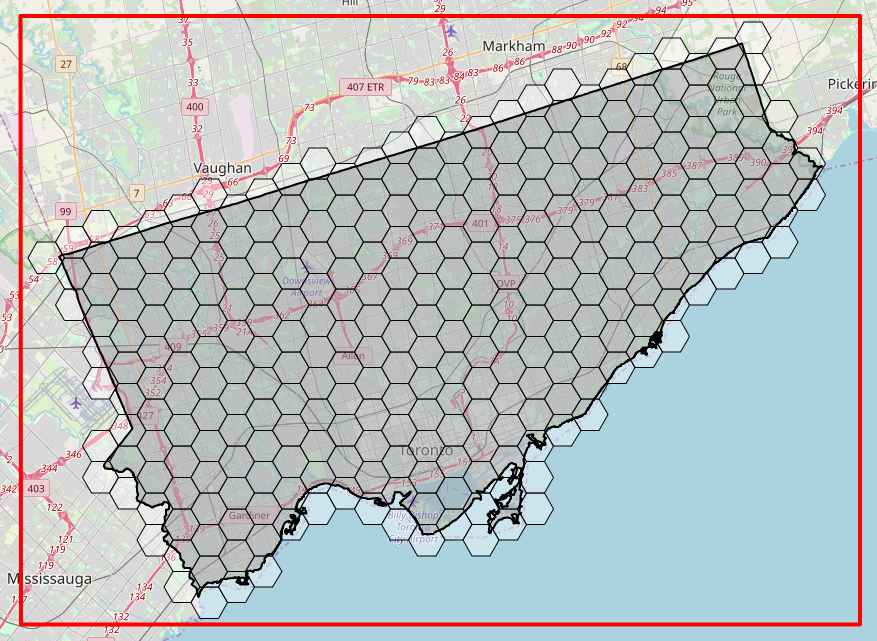
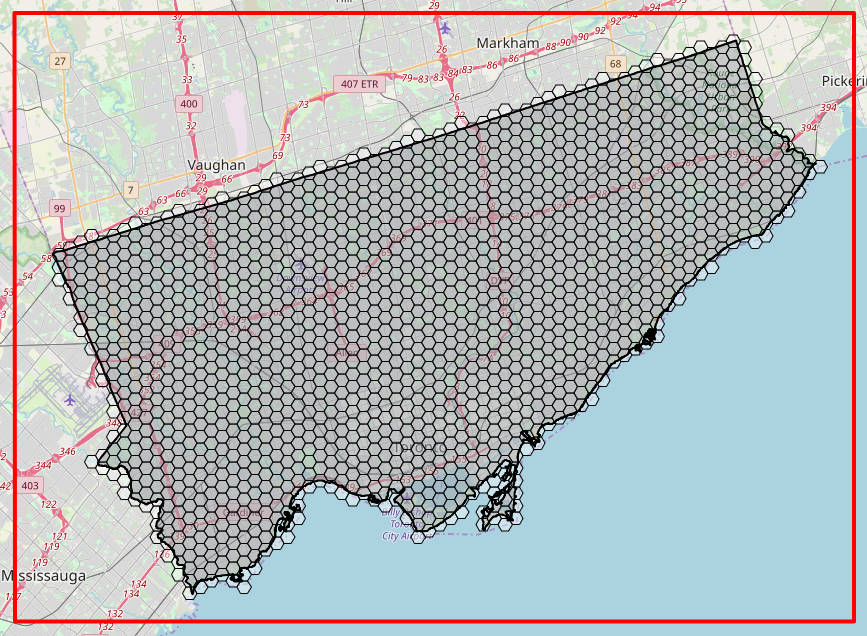
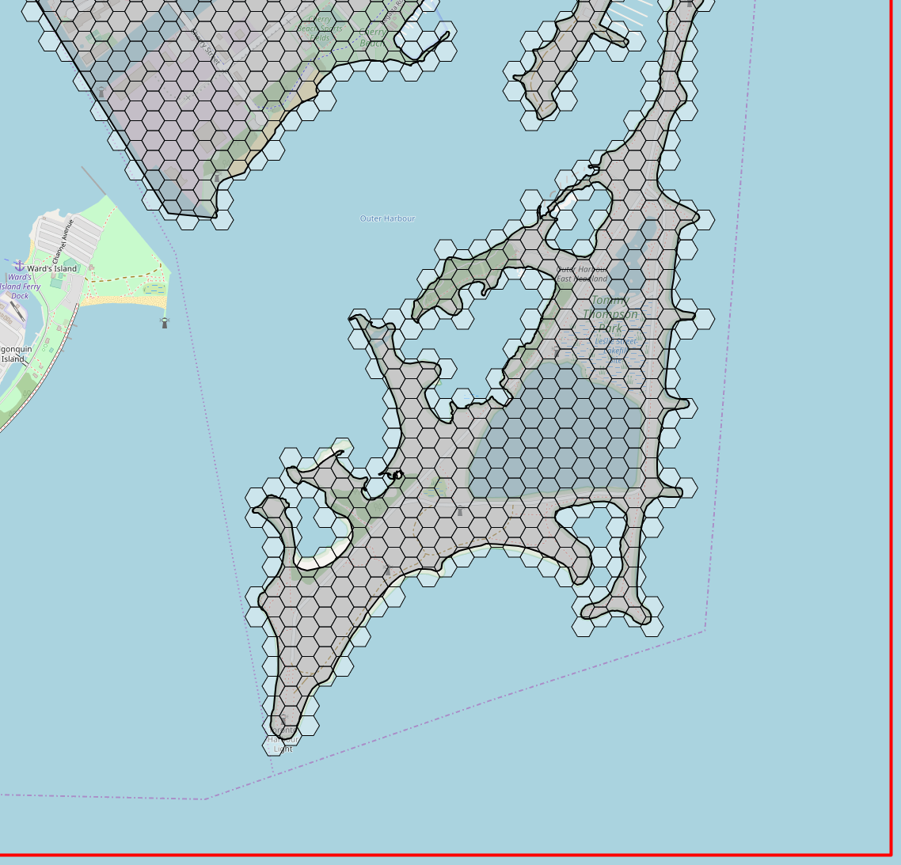

# geojson-grid-generator

Code required to generate a hexagon grid tessellation inside the boundaries of a polygon.

The generated grid includes those grid cells that overlap or touch the region boundaries.

**1km grid cell**



**400m grid cell**



**50m grid cell zoomed in**



## Features

- tessellation of the grid (i.e., resolution, density, etc.) can be updated by adjusting the `cellSide` variable

```js
const cellSide = 1;
const options = { units: "kilometers" };
```

## Use

### Generate Grid as a Geojson File

This runs the actual code in node and outputs a file `./src/grid.geojson` containing the grid in GeoJSON format.

Visualize the grid by importing the generated file to http://geojson.io.

```
npm install
npm run start
```

### Example

Runs an example in browser with a grid cell size of 1 km (for performance reasons).

```
npm run start:example
```

## Ward Data

Obtained from:

- https://open.toronto.ca/dataset/city-wards/
